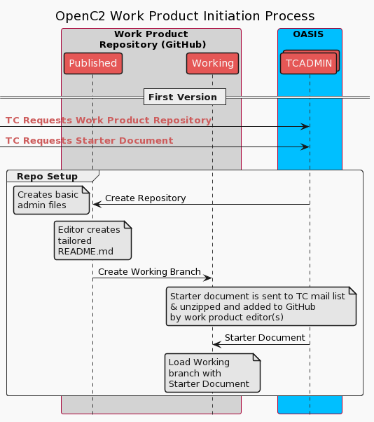
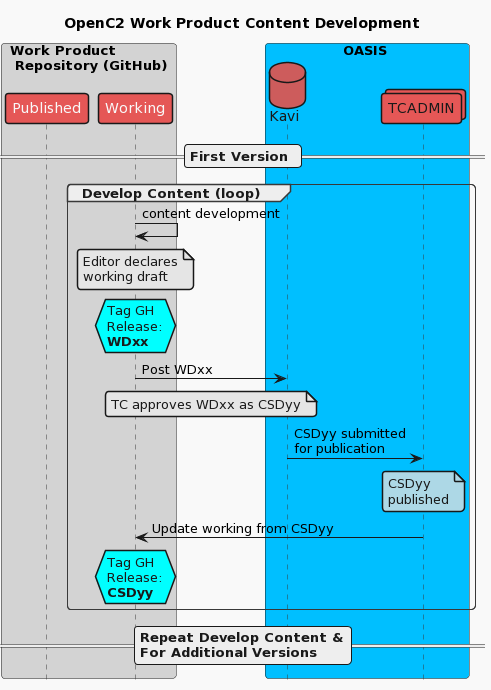
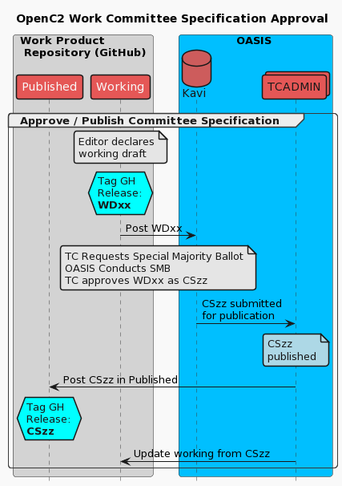
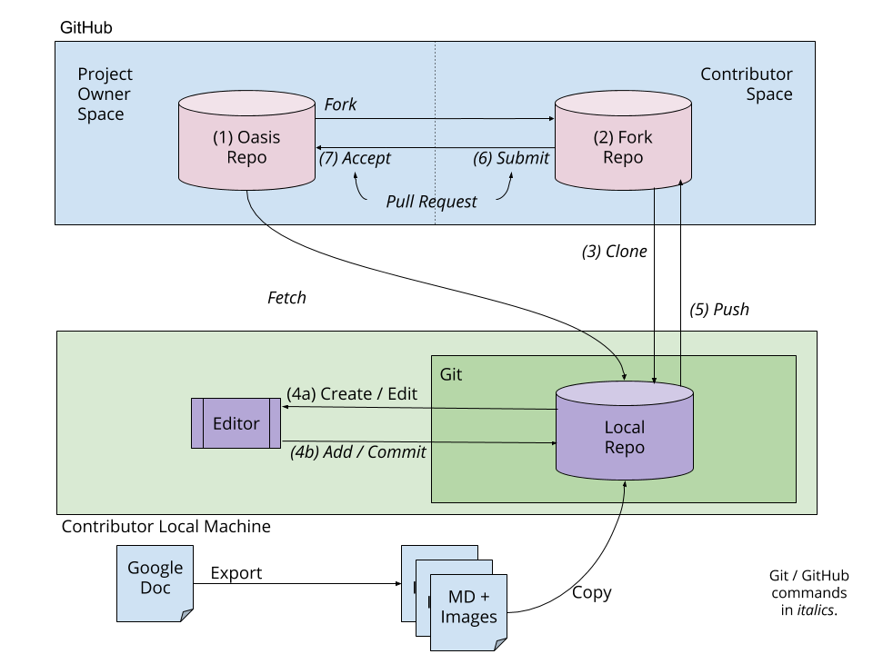
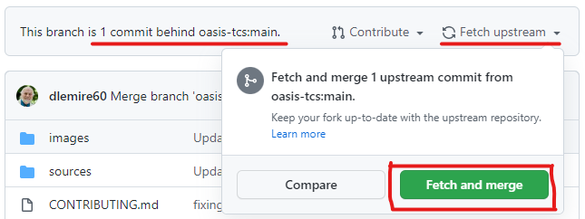

# Documentation Norms for the OpenC2 Technical Committee

# 1 Foreword

This document provides informal, internal guidance for [work
product](https://www.oasis-open.org/policies-guidelines/oasis-defined-terms-2018-05-22/#dWorkProduct)
editors in the [OASIS](https://www.oasis-open.org/) [OpenC2
Technical
Committee](https://www.oasis-open.org/committees/tc_home.php?wg_abbrev=openc2)
(TC).  It captures the working processes and norms being used by
the OpenC2 TC in the development of OpenC2 standards under OASIS
auspices. OpenC2 standards include the language specification,
actuator profiles, transfer specifications, etc., as well as
other supporting [work
products](https://www.oasis-open.org/policies-guidelines/oasis-defined-terms-2018-05-22#dWorkProduct)
(the OASIS term for what a TC produces).

**What is a "Work Product"?** Work Product is the official OASIS
term for the materials created by a TC in fulfillment of its
charter (e.g. narrative documents, schemas, sample code).

**What is an "Editor"?**  Excerpting from the OASIS Editor’s
Manual (see Section 2), a work product editor is responsible for:

* Creating and maintaining documents that reflect the consensus
  of the TC and incorporating agreed-upon changes clearly and
  unambiguously

* Helping to find consensus positions and providing text that
  gets the TC to agreement

* Bringing up unresolved issues at TC meetings, suggesting
  resolutions, and incorporating approved text as appropriate

* Preparing documents for review, coordinating with TC
  Administration, and presenting the document to the Technical
  Committee for approval for a public review

* Creating and maintaining public review comment logs

The guide says "It’s safe to say that the role of editor is
likely to be the most intensive job of any in the Technical
Committee. In return, however, you will find your name on the
front page of the published work, you will exert the greatest
influence over the form and substance of the finished document,
and you will be in the best position to develop relationships
with other experts and thought leaders in the TC."

These *Documentation Norms* will gradually be honed to a more
polished form, but will likely always be something of a "work in
progress".

* * *


# Table of Contents
- [1 Foreword](#1-foreword)
- [List Of Figures](#list-of-figures)
- [To-Do List](#to-do-list)
- [2 OASIS Guidance for Editors](#2-oasis-guidance-for-editors)
- [3 Work Product Development Overview](#3-work-product-development-overview)
  - [3.1 Family of Documents](#31-family-of-documents)
  - [3.2 "Agile" document development concept](#32-agile-document-development-concept)
  - [3.3 Work Product Development Sequence](#33-work-product-development-sequence)
  - [3.4 GitHub, Markdown, Repositories, and Fork & Pull](#34-github-markdown-repositories-and-fork--pull)
- [4 OpenC2 TC Work Product Development Process](#4-openc2-tc-work-product-development-process)
  - [4.1 Identify Work Product Need](#41-identify-work-product-need)
  - [4.2 Assign Work Product Name](#42-assign-work-product-name)
  - [4.3 Establish Development Environment](#43-establish-development-environment)
    - [4.3.1 Request Template](#431-request-template)
    - [4.3.2 Request Repository](#432-request-repository)
    - [4.3.3 Configure Repository](#433-configure-repository)
      - [4.3.3.1 README.md Content Update](#4331-readmemd-content-update)
      - [4.3.3.2 Create and Populate Branches](#4332-create-and-populate-branches)
  - [4.4 Incremental Development](#44-incremental-development)
    - [4.4.1 Creating & Posting a Working Draft](#441-creating--posting-a-working-draft)
      - [4.4.1.1 Document Updates for WD](#4411-document-updates-for-wd)
      - [4.4.1.2 Create GH Release and Upload to OASIS](#4412-create-gh-release-and-upload-to-oasis)
  - [4.5 Public Review Comment Handling](#45-public-review-comment-handling)
  - [4.6 CS Approval & Publication](#46-cs-approval--publication)
- [Appendix A: Links to Useful Software](#appendix-a-links-to-useful-software)
- [Appendix B: Getting Comfortable with GitHub](#appendix-b-getting-comfortable-with-github)
  - [B.1 Local Names for Remote Repositories](#b1-local-names-for-remote-repositories)
- [Appendix C: Some Markdown and Document Management Tips](#appendix-c-some-markdown-and-document-management-tips)
  - [C.1: Short Lines in Markdown Source](#c1-short-lines-in-markdown-source)
  - [C.2: Internal Hyperlinks](#c2-internal-hyperlinks)
  - [C.3 Creating Images and Editable Sources](#c3-creating-images-and-editable-sources)
- [Appendix E: Google Document Formatting Standards (Legacy)](#appendix-e-google-document-formatting-standards-legacy)
  - [E.1 Section Numbering](#e1-section-numbering)
  - [E.2 Figure & Table Numbering](#e2-figure--table-numbering)
  - [E.3 Acknowledgement Sections](#e3-acknowledgement-sections)
  - [E.4 Hash Marks for Markdown Headings](#e4-hash-marks-for-markdown-headings)
  - [E.5 Markdown Considerations During Publishing](#e5-markdown-considerations-during-publishing)
- [Parking Lot](#parking-lot)
    - [(old) Figure 2: Work Product Repository Branching Concept](#old-figure-2-work-product-repository-branching-concept)


# List Of Figures
  - [Figure 1: New Work Product Launch](#figure-1-new-work-product-launch)
  - [Figure 2: Working and Published Branches](#figure-2-working-and-published-branches)
  - [Figure 3: New Work Content Development](#figure-3-new-work-content-development)
  - [Figure 4: Committee Specification Approval](#figure-4-committee-specification-approval)
  - [Figure 5: Relationships Among GitHub Repositories](#figure-5-relationships-among-github-repositories)
  - [Figure 6: Upstream Fetch and Merge](#figure-6-upstream-fetch-and-merge)


* * *
# To-Do List

> To-Do:  Need to clean up (or possibly remove) the end matter 
related to exporting GDocs to MD

> To-Do:  Determine if table formatting needs improvement

> To-Do:  Identify additional useful software tools (especially for non-Windows OSes)

* * *


# 2 OASIS Guidance for Editors

Work product editors should become familiar with OASIS guidance on development of normative and non-normative products; here are links to important guidance documents:

* **OASIS Technical Committee Process:** OASIS has a structured process for the establishment of TCs and the development of work products by a TC. While a document editor doesn't need an understanding of the complete process, familiarity with 
[Section 2. TC Work Products](https://www.oasis-open.org/policies-guidelines/tc-process-2017-05-26#tcWorkProducts) will be helpful.

* **OASIS Editor's Manual:** On 5 September 2018 the OASIS [Technical Advisory Board (TAB)](https://www.oasis-open.org/committees/tc_home.php?wg_abbrev=tab) announced version 1.0 of the OASIS Editor's Manual, to be shared with specification editors. The manual is captured in four Google Docs for now. Anyone with the link can add comments and the TAB welcomes feedback. Please feel free to comment directly to the documents. If you prefer, you can send your thoughts to tab-askthetab@lists.oasis-open.org. The Editor's Manual is published in four parts (about 30-35 total pages): 

    * **Part 1: [The Role of Editor](https://docs.google.com/document/d/1lTartcAzlqidzrCxuXFFiwdRDKRipqMnNsMS24SZdjg/edit#heading=h.bi4fdsq13pue):**  explains the basics of the job you undertake when you volunteer to edit a work product.  

    * **Part 2: [The Editorial Process](https://docs.google.com/document/d/1gaYTQleiGMRA1vt2sLo1YUXqlGJe-JXgukJvSSlOhRI/edit#heading=h.bi4fdsq13pue):**  describes the work flow for TC work products from working draft through OASIS Standard.

    * **Part 3: [Document Structure](https://docs.google.com/document/d/1yA-wt2wB4NOpgoQ81VBfuJ1WPA1GK_BuddiVP_L6BnU/edit#heading=h.psw0b8lwn5fm):** covers the components of work products including required sections and considerations about whether to organize a work product as a single part or a multi-part work. 

    * **Part 4: [Work Product Preparation](https://docs.google.com/document/d/10lt8f2pn_ebZTsWJiGYiWYzyo6NbjuTskvDcS2tSyPw/edit#):** covers lessons learned, tips, etc for preparing documents without errors.

* **Related guidance:** Other documents produced by the OASIS TAB address related topics: 

    * _[The OASIS Naming Directives](http://docs.oasis-open.org/specGuidelines/ndr/namingDirectives.html)_. To keep a vast collection of works like the content from OASIS TCs organized in a sensible manner requires some rules governing the organization and naming of work. This document lists the limitations and requirements that apply to filenames, directories in the OASIS libraries, structural organization of work, namespaces, titles and version numbering, etc.

    * _[Keyword Guidelines for OASIS Specifications and Standards](https://www.oasis-open.org/policies-guidelines/keyword-guidelines)_. Most normative content at OASIS uses RFC2119 keywords. (The exception is work planned to be submitted to a *de jure* standards organization like ISO at a later date.) This document provides guidance on how to most effectively use keywords with drafting specifications. 

    * _[Guidelines to Writing Conformance Clauses for OASIS Specifications](http://docs.oasis-open.org/templates/TCHandbook/ConformanceGuidelines.html)_. OASIS specifications require a section with clauses that an implementation must comply with in order to be deemed a conforming implementation. This document gives guidance on how to go about preparing these for your specification.

    * _[Proposed Interoperability Guidelines](https://wiki.oasis-open.org/tab/InteropGuide)_. These guidelines help you write specifications that are precise enough to ensure that implementations are interoperable.

    * _[W3C Recommendation Citation List for OASIS Editors](http://docs.oasis-open.org/templates/w3c-recommendations-list/w3c-recommendations-list.html)_. This document lists current W3C Recommendations in proper citation format for easy cut-and-paste into OASIS specs.

    * _[IETF RFC Citation List for OASIS Editors](http://docs.oasis-open.org/templates/ietf-rfc-list/ietf-rfc-list.html)_. This document lists current IETF RFCs in proper citation format for easy cut-and-paste into OASIS specs.

    * _[Checklist for Verifying the Editorial Quality of OASIS Specifications](https://www.oasis-open.org/committees/document.php?document_id=54999)_. When you have a document ready to approve for publication, this document lists key checkpoints you can use to ensure that it is ready to go and avoid some common errors. This is the same checklist that OASIS staff and TAB use to review specification drafts during publication and public review. 

# 3 Work Product Development Overview

This section describes the process the OpenC2 TC is using in developing work products. 

## 3.1 Family of Documents

The [OpenC2 Language
Specification](https://docs.oasis-open.org/openc2/oc2ls/v1.0/oc2ls-v1.0.html)
is the foundation of a family of documents that collectively
define the language, tailor its use with specific cybersecurity
functions, and describe how other protocols are used in a
supporting manner (e.g., for message transfer). This family
includes a variety of document types:

* Language Specification
* Architecture Specification
* Actuator Profiles (APs)
* Transfer Specifications
* Supplementary documents
* Schemas

Documents of similar type (e.g., actuator profiles) within the
family logically have similar content and organization, so
familiarity with previously created OpenC2 specifications is
helpful when developing a new work product. 

## 3.2 "Agile" document development concept

The OpenC2 TC has been using a development process inspired by
agile software development concepts. Under this process, editors
work with the members of the TC to incrementally develop and gain
consensus regarding the content of a work product. This process
includes moderately frequent publication of updated work product drafts
that are then presented to the OpenC2 TC for approval as
[Committee Specification Drafts](https://www.oasis-open.org/policies-guidelines/oasis-defined-terms-2018-05-22#dCommitteeDraft)
(CSDs). *Approval of a CSD formalizes and documents TC consensus
on the material from that increment of development.*

Once the editors and TC members agree that a work product is
complete and mature, the remainder of its review and approval are
governed by the OASIS TC Process for public review, approval as a
Committee Specification, and eventual approval as an OASIS
Standard (following additional public review). Sections
[2.6](https://www.oasis-open.org/policies-guidelines/tc-process-2017-05-26#publicReview)
through
[2.8](https://www.oasis-open.org/policies-guidelines/tc-process-2017-05-26#OASISstandard)
of the [TC Process
document](https://www.oasis-open.org/policies-guidelines/tc-process-2017-05-26)
describe those aspects of work product development.

## 3.3 Work Product Development Sequence

The overall sequence for development of a work product, as
currently performed within the OpenC2 TC, is as follows:

* Identify WP Need
* Determine WP name
  * For Actuator Profiles, add the AP to the namespace registry
* Request starter template and GitHub repository
* Upload template and configure repository
* Apply agile, incremental development (cycle)
  * Development activity review and approval through the [working meeting process](Working-Meeting-Process.md)
  * Intermittent WD releases / CSD approvals
* Conduct Public Review (cycle)
* CS Approval & Publication

[Section 4](#4-openc2-tc-work-product-development-process) and
the Appendices provide detailed information about these steps.

## 3.4 GitHub, Markdown, Repositories, and Fork & Pull


As of December 2018, the OpenC2 TC shifted to focus on
[GitHub](https://help.github.com/en/github) as our primary tool
for the development of work products, and has adopted
[Markdown](https://en.wikipedia.org/wiki/Markdown) (MD) as our
preferred authoritative format for work products (AKA documents)
and the GitHub [Fork & Pull
model](https://docs.github.com/en/pull-requests/collaborating-with-pull-requests/getting-started/about-collaborative-development-models)
for controlling the development of work product content. If
you’re completely unfamiliar with GitHub,
[Appendix B](#appendix-b-getting-comfortable-with-github)
provides an introduction and links to other helpful information sources.

>(NOTE:  The use of Google Docs as an initial development
>platform for work products remains available as an option; a
>script is available to export Google Docs to Markdown and can be
>used when the editor(s) is ready to shift to GitHub to mature
>the document. All TC member should have access to the TC's
>Google Drive space.)

Markdown is a text-based language that uses a simple formatting
syntax to make editing easy, the Markdown source very readable,
and the processed output nicely formatted. Since OASIS uses
GitHub repositories for version control, the OpenC2 TC is
specifically using 
[GitHub-Flavored Markdown](https://github.github.com/gfm/#what-is-github-flavored-markdown-)
(often shortened as GFM), the dialect of Markdown that is
currently supported for user content on GitHub.com and GitHub
Enterprise.

GitHub offers many useful features to support our process,
including rich version control features, issue capture and
discussion, easy editing of text-based formats, and ready
availability of free and open-source tools to support a variety
of working preferences. There are three types of GitHub
repositories in use by the OpenC2 TC:

* **TC Product Repos:** For each TC-sponsored work product, OASIS
  TC Administration creates a [GitHub "version control
  instance"](https://docs.github.com/en/repositories/creating-and-managing-repositories/about-repositories)
  (AKA "repository" (AKA "repo")), and assigns the editor(s) of
  the document as "maintainers". Maintainers have the privilege
  to
  [commit](https://help.github.com/en/github/getting-started-with-github/github-glossary#commit)
  changes to the repository's contents, be those changes their
  own work or contributions from other TC members. The assignment
  of maintainers is discussed in [Section
  4.3.2](#432-request-repository-and-assign-maintainers). 

* **TC Working Repos:** In addition to repos specific to
  individual work products, the TC has other repos to support its
  efforts, such as the capture of [use
  cases](https://github.com/oasis-tcs/openc2-usecases), and a
  repository to support development of [custom actuator
  profiles](https://github.com/oasis-tcs/openc2-cap) (which may
  eventually turn into TC work products and receive individual
  repos). This document is stored in the [TC Operations
  repo](https://github.com/oasis-tcs/openc2-tc-ops), which is
  another "working repo".

* **TC Open Repos:**  These are established by the TC to capture
  the development of (primarily) software related to the TC's
  objectives. 

This document is focused on the use of **TC Product Repos** to
develop TC work products (e.g., specifications, committee notes).
However, the TC's basic development process and the "fork & pull"
model can be applied to updating the contents of all three types
of repositories.

# 4 OpenC2 TC Work Product Development Process

This section outlines the TC's standard work product development
process.

## 4.1 Identify Work Product Need

Any TC member can propose a work product, typically by presenting
their idea to the TC membership (e.g., at the monthly TC
meeting). The work product will then need a name and an abstract
in order to submit the request for a starter document (naming and
starter document requests are discussed in the next section). In
addition, the TC must approve a motion requesting the
establishment of a version control instance (repo) for the newly
identified work product; a [simple majority
vote](https://www.oasis-open.org/policies-guidelines/oasis-defined-terms-2018-05-22/#dSimpleMajority)
is required for approval.

## 4.2 Assign Work Product Name

Once the need for a work product is established, the next step in
creating a new work product is to name the document and create a
shorthand for it. Give some thought to the product name when
requesting a starter document, as that name will live on
essentially forever. Consultation with the TC co-chairs and
secretary is recommended, as well as familiarity with the _[OASIS
Naming
Directives](http://docs.oasis-open.org/specGuidelines/ndr/namingDirectives.html)_.
Consultation with the OASIS TC Administration team is also
helpful, as they can assist with applying the naming directives
and help avoid collisions with the names of other OASIS products.

The TC's work products can be broken into over-arching documents
(e.g., Language Specification, Architecture Specification) that
define OpenC2 overall, and supporting documents (e.g., actuator
profiles, transfer specifications) that address specific features
and functions. To provide for consistency, the following
principles apply:
 - Overarching documents should spell out OpenC2 in their titles.
 - Supporting documents don't need to do so as they are dependent
   on the overarching documents.

The following example titles illustrate the application of these
principals:

- Open Command and Control (OpenC2) Language Specification
- Open Command and Control (OpenC2) Architecture Specification
- OpenC2 Actuator Profile for _cyberfunction_
- OpenC2 Transfer Specification for _protocol_


Since the TC name (i.e., "openc2") is already included in the
URLs and GitHub repo names that OASIS assigns there is no need to
include "openc2" or "oc2" in the shorthand name for the product
(a lesson learned since the TC's first work products were named).
A useful convention is to include the document type, so the
following patterns are recommended:

* Actuator profiles:  `ap-<function shorthand>`
* Transfer specifications:  `transf-<protocol shorthand>`

> NOTE:  The initial actuator profile for stateless packet
> filtering and transfer specification for HTTPS do not follow
> these patterns, but the patterns are recommended for new
> specifications. If a new type of document is needed, the TC
> co-chairs and secretary can assist in determining the naming
> pattern for the new document type.

As an example, an actuator profile for anti-virus might have the
shorthand of "ap-av", leading to:

* Repository name:  oasis-tcs / openc2-**ap-av**
* Document URL:
  docs.oasis-open.org/openc2/**ap-av**/v1.0/**ap-av**-v1.0.html

The OASIS TC Administration team will enforce the shorthand name
originally attached to a product when creating OASIS-published
versions (e.g., committee specification drafts [CSDs]). 

Here are some example names from current committee work; the last
three apply the naming conventions described above:

|  Document | Shorthand Name | Repo Name (openc2-...) |
| ---|:--:|:--:|
|  _Open Command and Control (OpenC2) Language Specification_ | oc2ls | …-oc2ls |
|  _Open Command and Control (OpenC2) Actuator Profile for Stateless Packet Filtering_ | oc2slpf | ...-apsc-stateless-packet-filter |
|  _Specification for Transfer of OpenC2 Messages via HTTPS_ | open-impl-https | …-impl-https |
|  _OpenC2 Actuator Profile for Packet Filtering_ | ap-pf | ... openc2-ap-pf |  
|  _Specification for Transfer of OpenC2 Messages via OpenDXL_ | transf-odxl | …openc2-transf-odxl |
|  _Specification for Transfer of OpenC2 Messages via MQTT_ | transf-mqtt | ...-openc2-transf-mqtt |

### 4.2.1 Add Actuator Profile to Namespace Registry

All OpenC2 type definitions are contained in a specification, and
each specification is assigned a globally-unique namespace in the
form of a URI. Types in one specification can reference types
defined in another specification using a namespaced name. As
OpenC2 uses Actuator Profiles to extend the core language, for
these extensions to be recognized new APs must be added to the
Namespace Registry. A more complete discussion of OpenC2
namespaces can be found in [Appendix
F](https://docs.oasis-open.org/openc2/oc2arch/v1.0/cs01/oc2arch-v1.0-cs01.html#appendix-f-openc2-namespace-registry)
of the _OpenC2 Architecture Specification_.

A namespace entry has the following form (excerpt from the
namespace registry):

| Prop ID | Property Name | OpenC2 Specification                                                                              | NS Prefix | Namespace                                              | Status                                    |
|---------|---------------|---------------------------------------------------------------------------------------------------|-----------|--------------------------------------------------------|-----------------------------------------
|         |               | [OpenC2 Language Spec v1.1 Common Types](https://github.com/oasis-tcs/openc2-oc2ls)               | ls:       | http://docs.oasis-open.org/openc2/ns/types/v1.1        | Types section of LS                       |
| 1024    | slpf          | [Stateless Packet Filtering AP](https://github.com/oasis-tcs/openc2-apsc-stateless-packet-filter) | slpf:     | http://docs.oasis-open.org/openc2/ns/ap-slpf/v1.0      | CSPRD01 2019/05/31 superseded by PF      


The namespace registry is maintained in the [GitHub repository
for the Architecture
Specification](https://github.com/oasis-tcs/openc2-oc2arch), in
the file `namespace-registry.md`. When initiating the development
of a new AP, a pull request should be made to update the
namespace registry file with a new line representing the new AP;
the `Prop ID` value for the next AP should be one greater than
the `Prop ID` of the highest-numbered Standard Actuator Profile,
and the `Property Name` and `Namespace` values should be set to
the `<function-shorthand>` for the new AP.

## 4.3 Establish Development Environment

The development environment for a new work product includes the
starter document template from OASIS and the work product's
[GitHub repository
("repo")](https://docs.github.com/en/repositories/creating-and-managing-repositories/about-repositories).
The environment grows over time with forks of the repo created by
contributors. The process for establishing and initializing the
development environment is illustrated in Figure 1 and
described in the following sections. The process utilizes the
GitHub repository branching concept further described in [section
4.3.3](#433-configure-repository)


### Figure 1: New Work Product Launch
_(source: sources/work-product-init.plant.txt)_




### 4.3.1 Request Template

Once a new work product is identified and a product name and
shorthand selected, the next step in the process is to request a
template / starter document from OASIS. For a markdown-formatted
product, a companion request is made for a GitHub repo in the
TC's space (i.e., [oasis-TCs /
openc2-...](https://github.com/oasis-tcs?utf8=✓&q=openc2&type=&language=)).

While it might seem reasonable to launch a new work product by
cloning an existing TC product, following the OASIS process has
several advantages:

* Encourages the TC and the editor(s) to think through naming the
  work product appropriately

* Creates awareness of the new work product in OASIS TC
  Administration, and gives them an opportunity to identify any
  possible problems (e.g., a name collision with other OASIS work
  [which has happened])

* Ensures that the work product begins from a template that
  reflects current OASIS formats and guidelines

Requesting a template / starter document creates *no* obligation
for the TC or the editor(s) that the work product will be
completed.

Both the template / starter document and a GitHub repo are
requested using forms on the [TC Admin
Requests](https://www.oasis-open.org/resources/tc-admin-requests)
page. Any TC member may place the requests, but typically this
will be handled by some one of: the document editor(s), the TC
co-chairs, or the TC Secretary. Editors who are uncertain how to
proceed should request assistance from the Secretary. Submitting
a TC Admin request requires login with the submitter's OASIS Kavi
credentials. The relevant forms on the TC Admin Requests page
are:

* Request a template / starter document (use the notes section of
  the request form to specificallyk request a Markdown-formatted
  starter document)

* Request a TC GitHub version control instance be created (this
  requires a link to the TC meeting minutes where the repository
  request was approved)

> NOTE:  Links to Individual request forms are not provided here
> to allow for future changes by TC Admin. Use the TC Admin
> Requests link above to get to the list of forms.

In response to the request for a template / starter document, TC
Admin will send a message to the TC mail list with an attached
ZIP file containing:

* a Markdown file (.md) -- this is the main template or starter
  document, customized with titles and other elements for this
  Work Product
* an HTML version generated from the markdown - for reference
* a directory /styles containing an HTML style sheet (.css)
* a directory /images containing an example image file
* a "README" text file with important instructions

The editors / maintainers are responsible for unzipping the
attachment and populating the repo with the starter document
content for the work product. The email with the starter document
package contains other valuable info, which the editor(s) should
also read (the same information is included in the README text
file).

### 4.3.2 Request Repository and Assign Maintainers

OASIS TC Administration has overall control of repositories for
OASIS work products (i.e., repositories that appear in the
`github.com/oasis-tcs/...` space on GitHub). TC Administration
are the only entity that can create new repositories, rename
existing repositories, archive a repository that is no longer
needed, and manage GitHub user privileges regarding any
particular repository.

When requesting a repository for a new work product, the TC
provides descriptive information for the work product, a link to
the TC meeting minutes that document approval of the repository's
creation, and identifies the maintainer(s) to be assigned to the
new repo. The OpenC2 TC's convention is that the maintainers of a
work product repo are:

 - All editors of the work product,
 - The TC co-chairs, and 
 - The TC secretary.

The co-chairs and secretary are named as maintainers to provide
backup / continuity if the editor(s) become unavailable. Every
maintainer must establish a [GitHub](https://www.github.com)
account. Document editors must be familiar with the OASIS
guidance on using [GitHub Repositories for OASIS TC Members'
Chartered
Work](https://www.oasis-open.org/resources/tcadmin/github-repositories-for-oasis-tc-members-chartered-work).
In particular, the repo maintainers must enforce that
contributions to the work product are only from TC members and
that the Intellectual Property policy under which the TC operates
is enforced.

The GitHub identifiers of the maintainers are listed in a "write
team" on the site. When OASIS TC Administration creates the repo,
they will assign the maintainers by addeing them to the write
team, and then will notify the TC mail list once the repo has
been created. A list of the TC's work product repos and the
maintainers associated with each can be found on the OASIS
[Teams](https://github.com/orgs/oasis-tcs/teams?utf8=%E2%9C%93&query=openc2)
page on GitHub. Changes to a repository's write team can be
intituted by emailing a request to the OASIS TC Administration
team (i.e, Chet Ensign and Paul  Knight).


### 4.3.3 Configure Repository

The following branching scheme has been worked out to facilitate
the configuration control of work products developed by the
OpenC2 TC. The two branches in the repo are intended to organize
the work as follows:

* The *Working* branch contains the newest content for the work
  product, material that is actively being developed, and subject
  to potentially frequent and significant change. Contributors to
  the work product should target their inputs to the Working
  branch. Working Draft (WD) versions of the work product are
  identified using the GitHub Release feature with the Working
  branch content as the basis for the release, and the WD content
  is them uploaded to the TC's document store at OASIS (see [Section 4.4.1](#441-creating--posting-a-working-draft) for details).

* The *Published* (default) branch contains TC-/OASIS-approved
  Committee Specification (CS) and OASIS Standard (OS) versions
  of the work product. Until the first CS is approved the
  Published branch will only contain administrative documents.

The TC repos' standard `README.md` files include the following
graphic to highlight this organization:

### Figure 2: Working and Published Branches


#### 4.3.3.1 README.md Content Update

When OASIS creates a repository for the work product it will be
populated with three files:

* **CONTRIBUTING.md:** rules and restrictions on contributing to
  this repository

* **LICENSE.md:**  information on applicable OASIS policies and
  Intellectual Property (IP) constraints.

* **README.md:**  overview of the repository's contents and
  purpose. This file is displayed by default when anyone loads
  the repository home page (NOTE: this is different than the
  README.txt in the starter template).

The first two files must remain when other contents are added to
the repository. 

The OpenC2 TC has developed a [model README.md
file](MODEL-README.md), a copy of which is contained in the [TC
Ops repo](https://github.com/oasis-tcs/openc2-tc-ops). The
editor(s) should copy, rename, and modify the MODEL-README.md
file  with information specific to the new repository and the
work product it contains. The model README.md is annotated with
the types of updates needed and the TC Secretary can provise
assistance in tailoring the model README.md for the specific work
product.

#### 4.3.3.2 Create and Populate Branches

As shown in [Figure 1](#figure-1-new-work-product-launch) above,
when the repo is available the maintainers should create a
`working` branch from the `published` branch, and then populate
the `working` branch with the starter document received from TC
Administration (including the subdirectories and supporting
files). Activity to develop the product then proceeds as
described in the next section. The `published` branch will only
have administrative files until a CS is approved, at which point
the maintainers populate it with the current CS version. Each
time a new CS is approved the `published` branch is updated.

Typical contents of the working branch are:

```
<work product>.md  <-- the primary file containing the work product contents
/images            <-- folder with binary files for images in the document
/sources           <-- folder with sources to allow editing/updating images
```

There may be other folders or files as appropriate to the work product under development.

Work-in-progress is always handled in the `working` branch,
using the standard GitHub mechanisms of forking the work
product repository and creating pull requests (PRs) with
contributions. When Working Drafts (WDs) are declared, the
GitHub Release feature is used to create the WD package for
upload to OASIS.  If a WD is approved as a Committee
Specification Draft (CSD) the editors should edit the
Release description to (i) record that the WD was approved
and the CSD version, and (ii) add a link to the published
CDS at OASIS. A link to the approval ballot can also be
added to the release description.

## 4.4 Incremental Development

> **NOTE:  In September 2024 OASIS published
> [Document Life Cycle Best Practices](https://www.oasis-open.org/policies-guidelines/document-life-cycle-best-practices/)
> and in November 2024 the OpenC2 TC adopted the standing rules suggested in that document as
> [Standing Rules 7, 8 and 9](https://groups.oasis-open.org/communities/tc-community-home2?CommunityKey=a34c9baf-48b2-44c5-a567-018dc7d32296#other).
> Those changes significantly affect the work product development process and the description below _has not_
> been updated to align. Work Product editors should consult the Best Practices document for guidance and request assistance from the TC Secretary if needed. In particular, under the new best practices the term "Working Draft" only applies 
> [prior to a TC accepting a proposal to become a work item](https://www.oasis-open.org/policies-guidelines/document-life-cycle-best-practices/#DocRevertBP).**

Developing a document on GitHub requires the editor to develop a level of comfort with two distinct skills:

* Authoring a document using [Github-Flavored](https://en.wikipedia.org/wiki/Markdown#GFM) [Markdown](https://en.wikipedia.org/wiki/Markdown) for formatting
* Using GitHub / Git procedures for version control

Document creation using GitHub is inherently text-based. It is
possible for an editor to do all of their work entirely within
GitHub, but for many it may be more comfortable and/or convenient
to create a local copy of the repository to enable use of
preferred text editors, working offline, etc. 
[Appendix A](#appendix-a-links-to-useful-software) provides suggestions for
useful software. [Annex
B](#annex-b-getting-comfortable-with-github) provides an overview
of establishing an environment with a related set of repositories
to enable working in this manner and a link to an excellent
explainer; other resources can readily be found by searching
on-line. TC members are also happy to share their GitHub
knowledge, and GitHub provides an extensive
[help](https://help.github.com/en) library.

Figure 3 illlustrates the flow of information between GitHub and
OASIS as working drafts are posted and CSDs are approved. It also
illustrates the use of GitHub release tags to enable precisely
locating specific versions of the work product in the repository.
Figure 3 also shows updating the working version from a published
CSD. It is common for OASIS TC Administration to find and fix
issues in work products during publiction (e.g., correcting
broken links). The incorporation of such changes into the working
version aids in the publication of future versions. The details
of such changes are commonly included in the message sent to the
TC mail list when a CSD is published. 

### Figure 3: New Work Content Development
_(source: sources/dev-content.plant.txt)_



### 4.4.1 Creating & Posting a Working Draft

A frequent occurrence in developing a work product is the posting
of a "Working Draft" (WD) version to OASIS. This must be done, in
particular, any time a ballot is to be held to approve a document
as a Committee Specification Draft (CSD), which happens
periodically during our "agile" document development process. The
GitHub
[Releases](https://help.github.com/en/articles/managing-releases-in-a-repository)
feature is used to tag a WD within GitHub and to help create the
WD package for upload to OASIS. The creation of a WD is a
two-step process:

1. In the `working` branch,  refresh the document's table of
   contents (see next section) and ensure the document title page
   is updated to reflect the correct WD number and date.

1. Use the GH Releases feature to create the release package.

#### 4.4.1.1 Document Updates for WD

As final preparation to create a WD, editors should
* update the WD sequence number and date information on the title
page so that they are current, and
* update the TOC within the Markdown file prior to declaring a
  release to create a WD. 

If using Microsoft Visual Studio Code, the Markdown All-In-One
extension is very helpful, and can create and update TOCs within
the editor.

Another alternative is
[pandoc](#appendix-a-links-to-useful-software). a flexible document
conversion tool that can created the TOC in a local file, as
follows:

`pandoc -f gfm --toc --toc-depth=5 -s -o <outfile> <infile>`

where `<infile>` and `<outfile>` are markdown files. The
`<infile>` is the markdown file from GitHub containing the
working draft content.  The TOC will be added to the `<outfile>`
at the beginning of the file, and the editors must manually move
it to the proper place in the document. There may be other
clean-up required of the TOC (e.g., extraneous headings); the
editor should review it carefully, delete unwanted content, and
confirm that all internal document links work properly.

#### 4.4.1.2 Create GH Release and Upload to OASIS

The editor uses GitHub to [create a
release](https://help.github.com/en/articles/creating-releases),
and assigns it an appropriate identification tag, typically
identifying the target version and the WD revision number (e.g.,
v1.0_WD05). GitHub creates a ZIP file containing the contents of
the selected branch of the repository at the time of the
release's creation. That ZIP file is the basis for the WD
package.

The essential contents of the WD package are

* the Markdown file for the document, and 
* any image files, which should be in the /images folder. 

The `/sources` folder can be deleted prior to uploading the WD to
OASIS.

The editor has the option to create and include an HTML file;
this can be done using `pandoc` and the CSS files supplied by
OASIS in the template / starter document package. While the HTML
file is optional, creating one can be helpful in that the HTML
version provides an easily-readable rendered version of the
markdown file that can be reviewed in a browser for quality
control purposes. `pandoc` comes into play again here to create
the HTML file. With the `working` branch checked out and the
directory containing the work product markdown file as the
current directory, the following command will create the HTML
file:

`pandoc -f gfm -t html <filename>.md -c
styles/markdown-styles-v1.7.css -s -o <filename>.html --metadata
title="Title of Specification Version X.Y"`

> NOTE: if creating an HTML file, the editor can also point to
> the CSS file maintaind at OASIS:
> `https://docs.oasis-open.org/templates/css/markdown-styles-v1.7.3a.css`;
> this URL can be referenced directly in the `pandoc` command
> after the `-c` option.

The editor should remove extraneous material from the ZIP file
(e.g., the image sources in the /src folder) prior to uploading
the ZIP file to OASIS as a WD.

## 4.5 Public Review Comment Handling

An essential part of the OASIS standards development process is
public review of TC work products, as documented in sections
[2.6](https://www.oasis-open.org/policies-guidelines/tc-process-2017-05-26#publicReview)
and
[2.8.2](https://www.oasis-open.org/policies-guidelines/tc-process-2017-05-26#OSpublicRev)
of the TC Process. During a public review, comments are submitted
via the TC mail list (for TC members) and the TC public comments
list (for non-TC members). The TC is required to:

> _acknowledge the receipt of each comment, track the comments
> received, and post to its primary e-mail list the disposition
> of each comment at the end of the review period. (TC Process,
> Sections 2.6 & 2.8.2)_

Disposition of comments can include any of (i) altering a
document to address a comment, (ii) deferring a comment to future
work (e.g., a later version of the document), or (iii)
determining that no change is required. The OASIS requirement is
to provide an artifact, posted to the TC's mail list, that
records the TC disposition decisions.  If no comments are
received during a public review, an email recording that result
is sent to the TC mail list as the artifact.

The OpenC2 TC is handling public review with a hybrid approach of
a Comment Resolution Matrix (CRM) captured in a shared Google
Sheet to maintain an overall record of comment disposition, along
with the use of [GitHub
issues](https://docs.github.com/en/issues/tracking-your-work-with-issues/about-issues)
in the associated work product repo to capture the details of how
each comment is addressed. The CRM connects the original comment
emails in the public archives of the TC and comment mail lists
with the GitHub issues and, if appropriate, pull requests where
the details of comment disposition are recorded. When the process
is complete, the CRM is exported to a PDF that is sent to the TC
mail list as the definitive public artifact recording the
outcomes.

The OpenC2 TC has a [CRM
template](https://docs.google.com/spreadsheets/d/1Kk6FOIHCs4M8KsLzSywwnsrMbarpIVM2m0T2ZC7h0zc/edit#gid=0)
in the `admin > template` folder on our [Google
Drive](https://drive.google.com/drive/folders/0ByY7rMsnC7rrY1JEMlBLckNXTG8).
Editors handling public review comments should make a copy of the
template, rename it appropriately, and use it for tracking
comment adjudication.  The CRM template columns are as follows:

|  Column | Usage |
| :----: | ---- |
|  Item # | A tracking identifier for the comment. Editor's discretion for assigning. It can be helpful to put this identifier into the titles of associated GitHub issues and pull requests for easy cross-referencing.  Recommended use is to combine a shorthand for the document with a sequence number. Using a leading hundreds (or thousands) value for the sequence number can key it to a particular public review (e.g., HTTPS-101 is the first comment from the first public review, HTTPS-203 is the third comment from the second public review).  The order of comments in the CRM has no significance. |
|  Source | Individual or organization that submitted the comment. |
|  Email Link | Web link to the specific email containing the comment in the OASIS public archive of the appropriate mail list (i.e., OpenC2 TC mail list public archive, OpenC2 TC comment mail list public archive) |
|  Section | Section of the document where the target of the comment appears. |
|  Page | Page where the target of the comment appears (usually from a PDF version of the document).  Optionally a column may be inserted for the line where the target of the comment appears, if line numbering was applied to the public review document. |
|  Comment (or Comment Summary) | The comment text or (editor's discretion) a summary of the comment. If a summary is used, the editor should: Use care to correctly capture the intent of comment, _and_ include the full text of the comment in the GitHub issue where it is addressed, to avoid any ambiguity. |
|  GitHub Issue Link | Web link to the GitHub issue where the comment will be discussed and disposition recorded. |
|  Resolution Summary | A brief summation of the disposition (e.g., "ACCEPTED: added language …", DEFERRED to later version). Having this summary in the CRM is important so that the permanent artifact in the OASIS archive meets the requirement to "post … the disposition of each comment", without need to refer to other sources. |
|  GitHub Change Link | Web link to the GitHub pull request where the specific document changes related to the comment, if any, are identified. |
|  Material? | Editor's assessment of whether any changes made to address the comment represent [material changes](https://www.oasis-open.org/policies-guidelines/oasis-defined-terms-2018-05-22/#dMaterialChange) to the work product. Material changes made to a document as a result of a public review require that the updated document undergo a subsequent public review of the changed material. |


Our editors have found it useful to employ GitHub's
[labels](https://help.github.com/en/articles/about-labels)
feature when organizing issues from public review comments for
discussion. Labels can be used to identify:

* Which public review generated a comment (e.g., PR01, PR02)
* A set of issues planned for discussion at an upcoming meeting
* A set of issues that all relate to a particular topic with a
  work product (e.g., Group_Actions)
* Issues that have tentatively reached resolution (e.g.,
  Candidate_For_Closure)
* Issues that are being deferred (e.g., Future)

Examine the issue labels in existing work product repos for
additional examples. GitHub creates a default set of labels for a
repository; these are oriented toward the standard software
development use case, and editors should feel free to delete them
if desired.

## 4.6 CS Approval & Publication

Figure 4 shows the process for approval and publication of an
OASIS Committee Specification (CS). The approval of a CS is
governed by Section
[2.7](https://www.oasis-open.org/policies-guidelines/tc-process-2017-05-26#committeeSpec)
of the TC Procedures. Once a public review has been completed
without material changes to the document, TC can request OASIS TC
Administration conduct a [Special Majority
Vote](https://www.oasis-open.org/policies-guidelines/oasis-defined-terms-2018-05-22#dSpecialMajority)
to approve the document as a CS. Once the CS is approved, TC
Administration will create the CS version of the document in
multiple formats, and publish an announcement on the OASIS home
page. The work product maintainers should upload the CS versions
of the product to the repository’s `published` branch, with
correspondent relevant updates to the README.md file. As with the
publication of a CSD, the editors should also update the
`working` branch copy of the work product source to incorporate
any changes made by OASIS TC Administration in the publication of
the CS.

### Figure 4: Committee Specification Approval
_(source: sources/pub-cs.plant.txt)_



# Appendix A: Links to Useful Software

* **Git**: open source version control software. Required to
  create and manage local repositories for local / offline
  editing -- [https://git-scm.com/](https://git-scm.com/)

* **pandoc**: This utility is a Swiss Army Knife of marked-up
  file conversions, and is also useful for creating tables of
  contents for Markdown files.  --
  [https://pandoc.org/](https://pandoc.org/) 

* **Microsoft Visual Studio Code**:  powerful free text editor
  that integrates easily with Git / GitHub. With appropriate
  extensions you can get a side-by-side view of raw and rendered
  Markdown while editing. MS VSC is based on the [Electron
  platform](https://www.electronjs.org/) so it is available for
  Windows, Mac, and Linux --
  [https://code.visualstudio.com/](https://code.visualstudio.com/)
  
* **[Diagrams.net](https://app.diagrams.net/)** (was Draw.io): an
  open source drawing tool (similar to Visio / Gliffy /
  LucidChart). It's a free, online diagram editor and viewer with
  a wide variety of shapes, icons, connector and templates. It
  can also import and export numerous file formats, albeit with
  some limitations. --
  [https://app.diagrams.net/](https://app.diagrams.net/)

  > NOTE: In a February 2020 [blog
  > post](https://www.diagrams.net/blog/move-diagrams-net) it was
  > announced that Draw.io is being renamed to diagrams.net. The
  > new home page is
  > [www.diagrams.net](https://www.diagrams.net/). For now,
  > draw.io redirects to diagrams.net, and the site still uses
  > <filename>.drawio.png as the default format for saving files
  > locally.)


* **[Tables
  Generator](http://www.tablesgenerator.com/markdown_tables)**: a
  website that will generate a template for a table in a variety
  of formats including Markdown, HTML, and others. This is a
  really useful resource for creating the structure of a table in
  Markdown, since doing that manually can be rather tedious.  You
  an also populate table content along with structure. --
  [http://www.tablesgenerator.com/markdown_tables](http://www.tablesgenerator.com/markdown_tables)

# Appendix B: Getting Comfortable with GitHub

For those unfamiliar with using GitHub and Git, [this
article](https://medium.com/hackernoon/github-for-chimpanzees-and-a-short-rant-against-scientists-868fb04e5e4a)
provides a helpful (albeit colorfully presented and highly
opinionated) explanation of the concepts and processes (feel free
to skip the introductory rant and jump to the GitHub-oriented
meat [search for "my previous article"]).  Another good
introduction is [this
article](https://readwrite.com/2013/09/30/understanding-github-a-journey-for-beginners-part-1/)
from someone who isn’t primarily a programmer. A web search for
"github writer" will yield other similar articles. Note that many
of these these articles tend to focus on the use of command line
`git`, which may be only minimially necessary if you're using a
GitHub-aware editor. Also, some were published long enough ago
that some details of the GitHub user interface have changed, so
the screenshots may be a bit out-of-date.

If you're unfamiliar with the use of Git and GitHub for version
control, the terminology and process can be a little bit hard to
grasp. The articles linked above can definitely help. The
following diagram illustrates the process of connecting GitHub
repos and a local Git repo to work on products.  The process
steps are listed below the diagram, with links to the [GitHub
glossary](https://help.github.com/en/github/getting-started-with-github/github-glossary)
for definitions of key terminology.

#### Figure 5: Relationships Among GitHub Repositories



> [Figure 5 Source (Google Draw
> File)](https://docs.google.com/drawings/d/10M4foaPrE3t1XCQGQ3Tr-cBVFmj5Zm9PccGUkuPeop8/edit)


1. GitHub: A Project Owner creates a
   [repository](https://help.github.com/en/github/getting-started-with-github/github-glossary#repository)
   ("repo") for the document. This the "primary" version of the
   document, and its repo is the
   "[Upstream](https://help.github.com/en/github/getting-started-with-github/github-glossary#upstream)
   Repo". In the case of OpenC2 TC work products, these repos are
   created and managed by OASIS TC Administration, with one or
   more TC members established as maintainers for the repo.

2. GitHub: A Contributor creates a
   [fork](https://help.github.com/en/github/getting-started-with-github/github-glossary#fork)
   (i.e., personal copy) of the upstream Repo in their own GitHub
   account. This fork will contain a copy of the upstream
   Repo's content as of the time the fork was created. The
   contributor can work purely in this document on the web, or
   create a local
   [Git](https://help.github.com/en/github/getting-started-with-github/github-glossary#git)
   repo (step #3) where they can, for example, edit with their
   favorite text editor or Git-/GitHub-aware tool set.

3. Local: A Contributor
   "[clones](https://help.github.com/en/github/getting-started-with-github/github-glossary#clone)"
   their GitHub fork of the document to a repo in the Git
   environment on their local system.

> NOTE: The default names in the [GitHub
> documentation](https://help.github.com/en/github/collaborating-with-issues-and-pull-requests/configuring-a-remote-for-a-fork)
> for the repos described in Steps 1 and 2 here are "upstream"
> for the "OASIS" repo, and "origin" for the "Fork" repo. The
> instructions in [B.1](#b1-local-names-for-remote-repositories)
> describes using `git` commands to establish the "OASIS" and
> "Fork" names used here.

4. Local: The Contributor can edit document content and create
   additional content, including graphics and other files in
   their local environment.  Command line `git` or a git-aware
   editing tool is used on the local machine command line to
   update the local repo to reflect new and modified content.

5. Local: When the Contributor wishes to submit material to
   change the primary document, they use the `git`
   "[push](https://help.github.com/en/github/getting-started-with-github/github-glossary#push)"
   command (on the local command line) to replicate their content
   to their fork repo. This updates the fork repo to match the
   local repo. Pushes can be done frequently to propogate local
   changes to the GitHub fork as a backup mechanism, until the
   Contributor determines it is time to contribute their changes
   onward. Note that `git`-aware editing tools, such as the
   Microsoft Visual Studio Code editor, have built-in support for
   pushing changes to GitHub, eliminating the need to use the
   command line.

6. GitHub: The Contributor creates a [Pull
   Request](https://help.github.com/en/github/getting-started-with-github/github-glossary#pull-request)
   (PR) from their GitHub fork repo back to the upstream repo to
   contribute their proposed changes to the primary document.
   Pull requests can target the default branch of the upstream
   repo or any other chosen
   [branch](https://help.github.com/en/github/getting-started-with-github/github-glossary#branch)
   (e.g., the "working" branch being used to accumulate changes
   toward a future version of a document). Recall that while
   `main` is the standard default branch on GitHub, `published`
   is the default for OpenC2 work product repos, as described in
   [Section 4.3.3](#433-configure-repository).

7. GitHub: The Project Owner can accept a PR to merge the
   Contributor's material into the specified branch of the
   upstream repo. This modifies the upstream document by
   incorporating the Contributor's additions and deletions.
   GitHub offers the Project Owner the option to edit the
   contribution before merging the pull request.

As the above process is executed, the upstream repo may be
receiving changes from multiple contributors, which means that
any one contributor's fork may become out of sync with the
upstream repo. GitHub has a feature to update a fork repo with
changes from the upstream repo. As shown below in [Figure
6](#figure-6-upstream-fetch-and-merge), when viewing your fork of
the upstream repository, GitHub will indicate if the currently
selected branch is behind the corresponding upstream branch.
Clicking on "Fetch upstream", and then selecting the "Fetch and
merge" button will update the fork from the upstream repository.
This greatly simplifies maintaining synchronization when multiple
parties are contributing to the upstream repository. Once you've
resynchronized your fork, you should then also synchronize the
local clone. If the upstream and the fork are badly out of
synchronization, it may still be more straightforward to delete
and recreate the fork (and your local clone). 

#### Figure 6: Upstream Fetch and Merge



## B.1 Local Names for Remote Repositories

By default the local `git` environment will identify the local
clone of your fork of a repository as `origin`, and the original
repository that was forked as `upstream`. It is possible to
rename the remote repositories to names the user prefers. This is
done using the command: 

```
git remote rename <current> <new>
```

The following commands will change the default names to `fork`
and `oasis`, respectively:

```
$ git remote rename origin fork
$ git remote rename upstream oasis
```

You can verify that two remote tracking branches have been
created: "fork" and "oasis" with the command `git remote -v`:

```
$ git remote -v
fork    https://github.com/<personal-account/<repo-name>.git (fetch)
fork    https://github.com/<personal-account/<repo-name>.git (push)
oasis   https://github.com/oasis-tcs/<repo-name>.git (fetch)
oasis   https://github.com/oasis-tcs/<repo-name>.git (push)
```

# Appendix C: Some Markdown and Document Management Tips

Markdown is text-oriented and intended to be both easily readable in its raw form, and easily rendered into HTML or other more visually pleasing forms. GitHub provides some guides for using GitHub-Flavored Markdown (GFM):

* [Basic markdown writing and formatting syntax](https://help.github.com/en/articles/basic-writing-and-formatting-syntax) (covers most of what you need to know; somewhat more detailed than the overview provided below)

* GFM overview:  [https://guides.github.com/features/mastering-markdown/](https://guides.github.com/features/mastering-markdown/) -- a quick guide to the most-used formatting features; will answer most questions.

* GFM spec:  [https://github.github.com/gfm/](https://github.github.com/gfm/) -- a detailed formal specification of GFM, more useful to programmers than editors, but can help with troubleshooting.

This section points out some aspect of using GFM to help simplify document creation, maintenance, and reading. 

## C.1: Short Lines in Markdown Source

`git` was originally created to track changes in computer source
code, which is generally very line-oriented, and lines of
computer code are typically relatively short. When GitHub
displays a diff, it's doing a line-by-line comparison between the
old and new versions. In a document, if a paragraph is one very
long line, it's much harder for GitHub to easily display the
line-in / line-out changes, so it's helpful to break the source
text into shorter lines and maintain that approach to make
changes more visible when viewing a diff (e.g., in a pull
request). 

## C.2: Internal Hyperlinks

Cross-links to a section header or figure label within a document
use the same hyperlink structure as ordinary web links, but with
a specific format for the `(link)` portion. As an example, the
following source:

```
[3.2.2 A Level 3 Heading](#322-a-level-3-heading)
```

will display as [3.2.2 A Level 3 Heading](#322-a-level-3-heading)
and is an active internal cross link.  

The text to display is the same as with any other link, but the
(link) portion has 

* a single leading hash mark, 
* the section number with punctuation removed, and 
* the section name in lower case with all spaces replaced with hyphens. 

When using a tool like `pandoc` to create a TOC, all of the TOC
entries are automatically created using this format so that the
TOC is a collection of active links to the document's sections.
Experience has shown that automatic TOC creation doesn't always
correctly handle headings that contain characters like ampersands
(&) and forward or back slashes, so a quality control check of
generated links is important, and some manual editing may be
necessary to fix a link that doesn't work due to special
characters.

## C.3 Creating Images and Editable Sources

When creating graphics for a work product, editors should favor
approaches that also create an editable original file, ideally in
an open format, available to TC for future use. The goal is to
ensure that a graphic can be edited, if necessary, for future
document versions. The suggested approach for graphic handling
is:

* Create a folder in the document repo to hold editable image
  sources (e.g., `/sources`)
* Create images using an open source or widely available tool
  (see suggestions below)
* Export images for use in document from the image editor in a
  suitable form (e.g., PNG, JPEG), and place those images in the
  `/images` folder in the document repo so that they can be
  linked into the document
* Place the corresponding editable source files for the image in
  the `/sources` folder

For images created and stored purely in web-based tools (e.g.,
Google Draw), create a file (e.g., `SourceLinks.md`) in the
`/sources` folder, and populate that file with brief descriptions
of the images and corresponding links to the original image file
in, e.g., the TC's Google Drive space.

Some suggestions for image editing / creation tools:

* Diagrams.net, [a free, on-line diagramming
  tool](https://www.diagrams.net/) similar to Visio / Gliffy /
  LucidChart

* [PlantUML](https://plantuml.com/), a tool that can render a
  variety of images from structured source text. Excellent for
  creating sequence diagrams. PlantUML's [on-line
  server](https://www.plantuml.com/plantuml/uml/SyfFKj2rKt3CoKnELR1Io4ZDoSa70000)
  can be used without need for any local software installation.
  Image source code can be freely transferred with copy-and-paste
  between a local copy of an image's source and the server's code
  window for updating.

* Gravit Designer, "full featured" [vector
  editor](https://www.designer.io/en/), has free and pro versions

* Vector diagramming /
  [SVG](https://en.wikipedia.org/wiki/Scalable_Vector_Graphics)-based
  tools like [Inkscape](https://inkscape.org/)

* Google Draw for diagrams created in the TC's OASIS Google Drive
  space

* Well-known office application drawing tools (e.g., PowerPoint,
  LibreOffice)


# Appendix E: Google Document Formatting Standards (Legacy)

While the OpenC2 TC is no longer primarily using Google
Documents to collaboratively develop documents, that process
was used successfully for some time, and a script is
available to export a Google Document to Markdown
(specifically GitHub-Flavored Markdown [GMF]) to create the
authoritative version for final TC approval and publication.
This appendix preserves the TC’s best practices for
initially developing work products using Google Docs.
Former TC member Jason Romano created the [script for
exporting Google
Docs](https://github.com/romanojd/gdoc-markdown-converter).


A Google Docs add-on called Paragraph Styles+ (PS+) is very useful to manage decimal outline numbering when developing work products in Google Documents. With the shift to using GFM for creating the TC’s authoritative versions, the visual formatting aspects of PS+ are no longer relevant, but its utility for renumbering remains helpful.

## E.1 Section Numbering

OASIS documents use [decimal outline numbering](https://en.wikipedia.org/wiki/Outline_(list)#Decimal_outline). The
use of Paragraph Styles+ makes this much easier. The TC uses "Annex" for
supplement section to documents (e.g., examples, acronym lists,
acknowledgements). Annex titles get Heading 1 formatting, which means Paragraph
Styles+ will number them; we edit out those numbers during the publishing
process.

## E.2 Figure & Table Numbering

*(need conventions for figure & table numbering)*

## E.3 Acknowledgement Sections

The Acknowledgements section should be the penultimate Annex, before the document revisions.  The OpenC2 TC's standard for entries in Acknowledgements sections is 

* Firstname Lastname, Org

sorted alphabetically by last name.  For example:

* Joseph Brule, National Security Agency.

* David Lemire, G2, Inc.

* Jason Romano, General Dynamics

Typically, document editors list any person who either voted or provided a comment via Github, Google Docs or via a ballot.  

## E.4 Hash Marks for Markdown Headings

David Lemire: What is the significance of lines that have leading hash marks?

Jason Romano: That's Markdown code for heading styles. It's a quick hack to differentiate between numbered and un-numbered headings. I may be able to remove that now that I'm using _Paragraph Styles+_ to manage section numbers. I'll experiment with that.

Nope. Now I remember. If I call it a "Heading" then _Paragraph Styles+_ wants to give it a number. When the document is converted to Markdown, the hash marks get interpreted as Headings, so the Markdown looks fine. The HTML and PDF versions will be taken from the Markdown. So only the Google Doc will look a little weird.

David Lemire: So # texttextext and something styled Heading 1 are both Heading one in MD, and the numbering comes from PS+? Either way I guess I just leave the hash marks alone.

Jason Romano: For the most part, you won't have to worry about the hash marks, because they should only show up in the front matter which should be static and the appendices. You'll want to manually add appendix numbering: D.1, D.2, D.2.1, etc.

Using PS+ to apply heading format to Annexes and their subsections will result in something like this:


## E.5 Markdown Considerations During Publishing

**TBSL:** inspecting the Google Doc to Markdown export results, some of the key points are here:

Formatting a trailing space:  if in the Google doc a trailing space is formatted, e.g., bold or italic, that will cause glitches in the rendering of the markdown file.  Example, with a $ sign replacing the trailing space in the Google Doc source; note that the $ is italic, but "we" isn't:

* In Google doc:  … in this *test document$*we include …, leads to

* Markdown:  … in this _test document _we include

The fix is to clear the formatting on the trailing space in the Google document and repeat the Markdown export.

Hash marks for headings

Limitations on table formatting

* Markdown doesn't render lists inside of table cells. Need to manually format with numbers or asterisks if you need something like that.

* If a table immediately follows a list in a Google Doc, the Markdown export script (as of Sept 2018) fails to insert a necessary blank line between the last list item and the table. The MD file needs to edited to manually add a blank line between the list and the table.

* * *


**Clean-up:**

* Move GDoc process to an Annex as the alternative approach?

    * Can strip out all of the Paragraph Styles+ formatting specifics, since formatting is now going to be handled by MD rendering and HTML CSS.

        * Need to confirm that GDoc Heading styles suffice for Jason's markdown conversion script

    * Probably still need the comment control script

    * Definitely need the MD export script


# Parking Lot

### (old) Figure 2: Work Product Repository Branching Concept


> [Figure 2 Source (Google Draw
> File)](https://docs.google.com/drawings/d/1k6-Sl9Ge4X0pQcF1jOFgG3Ognf514NuAWVVTBB8g7-k/edit)

Figure 2 assumes a Committee Specification has been approved (the
v1.0 document) and work is proceeding on a future version (the
v1.1 document). For a new work product, as shown in Figure 1,
above, the `published` branch would be populated with the
OASIS-supplied template, and then the `working` branch created
from the `published` so that the template is available in the
`working` branch as the starting point. Note that this branching
strategy is intended for the _work product_ managed in the repo.
There may be reasons to make changes directly to the `published`
branch, such as to update the information in the repo's README.md
file.
