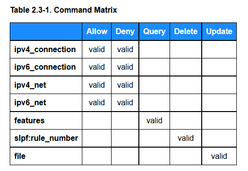

# Information Modeling: JADN and OpenC2

The [OpenC2 Architecture
Specification](https://docs.oasis-open.org/openc2/oc2arch/v1.0/cs01/oc2arch-v1.0-cs01.html)
abstract defines the objective of OpenC2:

> _Open Command and Control (OpenC2) is a concise and extensible
> language to enable machine-to-machine communications for
> purposes of command and control of cyber defense components,
> subsystems and/or systems in a manner that is agnostic of the
> underlying products, technologies, transport mechanisms or
> other aspects of the implementation._

The [OpenC2 Technical Committee
(TC)](https://www.oasis-open.org/committees/tc_home.php?wg_abbrev=openc2)
recognized the need to define the [OpenC2
language](https://docs.oasis-open.org/openc2/oc2ls/v1.0/oc2ls-v1.0.html)
in an implementation-independent manner in order to achieve the
project's goals, and created an information modeling language,
[JSON Abstract Data Notation
(JADN)](https://docs.oasis-open.org/openc2/jadn/v1.0/cs01/jadn-v1.0-cs01.html),
to support information modeling.

The IETF ([RFC 8477](https://www.rfc-editor.org/info/rfc8477))
has attributed challenges in achieve interoperability to a lack
of information modeling:

> _One common problem is the lack of an encoding-independent
   standardization of the information, the so-called information
   model. Another problem is the strong relationship between data
   formats and the underlying communication architecture_

Information models (IMs) are used to define and generate physical
data models, validate information instances, and enable lossless
translation across data formats. An IM defines the essential
content of entities used in computing, independently of how those
entities are represented (i.e., serialized) for communication or
storage.  While JADN was created by the OpenC2 TC, it is entirely
general purpose in its design and can be used to create IMs for
nearly any purpose. Examples of other possible JADN applications
include defining:

 - Data structures, such as [Software Bills of Materials
   (SBOMs)](https://www.ntia.doc.gov/report/2021/minimum-elements-software-bill-materials-sbom)
 - Information exchanges, such as are described by
   [NIEM](https://github.com/niemopen/oasis-open-project#readme)

RFC 8477 defines information and data models to clarify the
differences (emphasis added):

 - **Information Model** -- An information model defines an
      environment *at the highest level of abstraction and
      expresses the desired functionality*. Information models can
      be defined informally (e.g., in prose) or more formally
      (e.g., Unified Modeling Language (UML), Entity-
      Relationship Diagrams, etc.).  Implementation details are
      hidden.

 - **Data Model** -- A data model defines concrete data
      representations *at a lower level of abstraction, including
      implementation- and protocol- specific details*.  Some
      examples are SNMP Management Information Base (MIB)
      modules, World Wide Web Consortium (W3C) Thing Description
      (TD) Things, YANG modules, Lightweight Machine-to-Machine
      (LwM2M) Schemas, Open Connectivity Foundation (OCF)
      Schemas, and so on.

JADN provides a means to develop abstract IMs to facilitate clear
and unambiguous definition of information requirements and
support flexibility of implementation that supports
interoperability.

# A Brief JADN Overview

The JADN information modeling language was developed against
specific objectives:

1. JADN Core types represent application-relevant "information",
   not "data"
1. A single JADN specification unambiguously defines multiple
   data formats
1. The JADN specification uses named type definitions equivalent
   to property tables
1. The JADN specification is data that can be serialized
1. The JADN specification has a fixed structure designed for
   extensibility

The JADN core types are five primitive (or scalar) and seven
structured (or complex) information types, along with a variety
of options to refine the use of these types to model a broad
spectrum of information. JADN models are organized as [Directed
Acyclic Graphs
(DAGs)](https://en.wikipedia.org/wiki/Directed_acyclic_graph),
and complex models can be broken into packages that are related
using name space identifiers and links between packages. JADN
models can also be programatically translated among multiple,
equivalent representations:

 - JSON, the basic format of JADN
 - JADN Interface Definition Language (JIDL), an easy-to-read and
   -edit textual representation of JADN
 - Property tables
 - Entity Relationship Diagrams

More information about JADN can be found in the OpenC2 TC's
[Committee Note
(CN)](https://www.oasis-open.org/policies-guidelines/oasis-defined-terms-2018-05-22/#dCommitteeNote)
on [*Information Modeling Using
JADN*](https://github.com/oasis-tcs/openc2-jadn-im/blob/working/imjadn-v1.0-cn01.md)
(the link is to the in-progress draft, which is substantially
complete). The CN provides an overview of information modeling
and the use of JADN for that purpose. Detailed specifics can be
found in the [*Specification for JSON Abstract Data Notation
(JADN)*](https://docs.oasis-open.org/openc2/jadn/v1.0/cs01/jadn-v1.0-cs01.html),
an OASIS [Committee Specification
(CS)](https://www.oasis-open.org/policies-guidelines/oasis-defined-terms-2018-05-22/#dCommitteeSpec)
published in August 2021. Open source tools to process JADN
information models (abstract schemas) used to define OpenC2
content as well as other types of structured data, e.g., Software
Bill of Materials (SBOM), and validate data against an
information model can be found on Github in an OASIS TC Open
Repository of [JADN
Software](https://github.com/oasis-open/openc2-jadn-software).


# Information Models in OpenC2

Information modeling is used at two levels in OpenC2:

 - Definition of the OpenC2 Language
 - Documentation of the use of OpenC2 in context of a specific
   actuator, including actuator-specific extensions

## OpenC2 Language

The [OpenC2 Language
Specification](https://docs.oasis-open.org/openc2/oc2ls/v1.0/oc2ls-v1.0.html)
documents the language in a series of property tables, with
supporting text explaining details or constraints as needed. For
example, the following shows OpenC2's definition of a digital
artifact:

> 

Underlying the specification's contents is a rigorous JADN IM, in
which each OpenC2 data structure or type is precisely defined
(e.g., `Payload` and `Hashes` are structured types that are
further defined elsewhere in the OpenC2 IM). The JADN for the
`Artifact` type along with the definition of one of the linked
types (`Hashes`) is as follows (in JIDL format for readability):

```
Artifact = Record{1..*}
   1 mime_type    String optional    // Permitted values specified in the IANA Media Types registry, [RFC6838]
   2 payload      Payload optional   // Choice of literal content or URL
   3 hashes       Hashes optional    // Hashes of the payload content

Hashes = Map{1..*}   // Cryptographic hash values
   1 md5          Binary{16..16} /x optional  // MD5 hash as defined in [RFC1321]
   2 sha1         Binary{20..20} /x optional  // SHA1 hash as defined in [RFC6234]
   3 sha256       Binary{32..32} /x optional  // SHA256 hash as defined in [RFC6234]
```

While this is a simple example, it illustrates several key
points:

 - The use of both primitive (`String`) and structured
   (`Payload`, `Hashes`) types
 - The DAG aspect (fields in `Artifact` point to the structured
   types)
 - Since the property table is created programmatically from the
   underlying model, the specification authors can be confident
   of its accuracy
 - Modifications or additions to the model can readily be added
   to the specification

## OpenC2 Actuator Profiles

As explained in the [OpenC2 Architecture
Specification](https://docs.oasis-open.org/openc2/oc2arch/v1.0/cs01/oc2arch-v1.0-cs01.html), 

> _**OpenC2 Actuator Profiles (APs)** specify the subset of the
> OpenC2 language relevant in the context of specific actuator
> functions. ... A profile refines the meaning of language
> elements (actions, targets, command arguments, results) used to
> perform the actuator function, and often defines additional
> elements that are relevant and/or unique to that function._

An AP identifies the specific actions relevant to the actuator
(i.e., cyber defense function) in question, which targets align
with which actions, whether new actuator-specific targets are
needed, and other information necessary to specify the OpenC2
interface to the actuator. Just as with the OpenC2 Language, APs
are intended to be defined in implementation-independent terms so
that the exchange of commands and responses may be supported
using different protocols or transfer encodings while retaining a
common and consistent meaning. The IM for an OpenC2 AP is
therefore both a subset of the OpenC2 Language IM (as not all
actions or targets will apply to any individual actuator) and an
extension of it (to define actuator-specific elements). A feature
of every AP is the mapping of supported action / target
combinations to specify the set of commands valid for that
actuator. The [Stateless Packet Filtering
AP](https://docs.oasis-open.org/openc2/oc2slpf/v1.0/oc2slpf-v1.0.html)
includes the following command matrix (section 2.3, actions are
across the top, targets are down the left side including an
AP-specific target [`slpf:rule_number`]):

> 

As with the Language Specification, the AP is actually defined by
its underlying IM:

```
Action-Targets = Map  // Targets applicable to each action
   3 query            Query-Targets unique [1..10]
   6 deny             Allow-Deny-Targets unique [1..10]
   8 allow            Allow-Deny-Targets unique [1..10]
  16 update           Update-Targets unique [1..10]
  20 delete           Delete-Targets unique [1..10]

Query-Targets = Enumerated
   1 features

Allow-Deny-Targets = Enumerated
   1 ipv4_net
   2 ipv6_net
   3 ipv4_connection
   4 ipv6_connection
```

In fact, the development of the appropriate IM is the most
essential activity in the creation of an OpenC2 AP.

## _FAQs (for reference / reuse, to be deleted)_

### What is JADN?

[JSON Abstract Data Notation
(JADN)](https://docs.oasis-open.org/openc2/jadn/v1.0/cs01/jadn-v1.0-cs01.html)
is a UML-based information modeling language that defines
information requirements and data structure independently of data
format. JADN was created by the OpenC2 TC to assist with defining
 OpenC2 information models for the language and actuator profiles
in a way that supports the language's goal of enabling
machine-to-machine communications for purposes of command and
control of cyber defense components, subsystems and/or systems in
a manner that is agnostic of the serialization formats.

### How can I learn more about JADN?

The TC is developing a [Committee Note
(CN)](https://www.oasis-open.org/policies-guidelines/oasis-defined-terms-2018-05-22/#dCommitteeNote)
on [*Information Modeling Using
JADN*](https://github.com/oasis-tcs/openc2-jadn-im/blob/working/imjadn-v1.0-cn01.md)
(the link is to the in-progress draft, which is substantially
complete). The CN provides an overview of information modeling
and the use of JADN for that purpose. Detailed specifics can be
found in the [*Specification for JSON Abstract Data Notation
(JADN)*](https://docs.oasis-open.org/openc2/jadn/v1.0/cs01/jadn-v1.0-cs01.html),
an OASIS [Committee Specification
(CS)](https://www.oasis-open.org/policies-guidelines/oasis-defined-terms-2018-05-22/#dCommitteeSpec)
published in August 2021.

### Are there tools for working with JADN?

Open source tools to process JADN information models (abstract
schemas) used to define OpenC2 content as well as other types of
structured data, e.g., Software Bill of Materials (SBOM)
documents and validate data against an information model can be
found on Github in an OASIS TC Open Repository of [JADN
Software](https://github.com/oasis-open/openc2-jadn-software).
