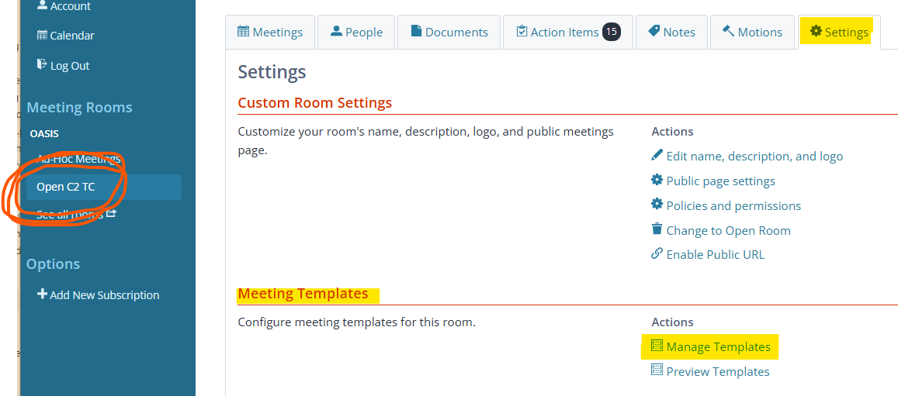
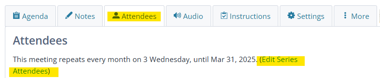

# Secretary's Notes on Meeting Scheduling

The [OpenC2 TC](https://groups.oasis-open.org/communities/tc-community-home2?CommunityKey=a34c9baf-48b2-44c5-a567-018dc7d32296)'s
routine meeting schedule is described in the [General Member
Information](./General-Member-Info.md) document. The following notes capture
some useful details regarding the meeting scheduling process.

Two systems are involved in scheduling OpenC2 TC meetings:

* The OASIS Community Platform is the system of record for OASIS TC operations.
* The OpenC2 TC uses [Lucid Meetings](https://meet.lucidmeetings.com/) to
conduct TC and working meetings.  

The Lucid Meetings [Fundamentals: Start
Here](http://support.lucidmeetings.com/support/solutions/folders/16000049332)
page provides an introduction to how things are organized in Lucid. Keys to
efficient scheduling in Lucid are to update (1) the meeting agenda template and
(2) the room membership prior to scheduling a meeting series. Lucid uses the
metaphor of Meeting Rooms for organizations. All of the actions described below
will be done in the OpenC2 TC "room".

## General Notes

* All OpenC2 meetings (both monthly TC and "weekly" working meetings) are
  scheduled in *both* OASIS & Lucid. The OASIS invitation allows members to RSVP
  for meetings, which is a pre-requisite for recording their attendance. The
  Lucid invitation provides the necessary information to join each meeting
  (member can RSVP to Lucid but there is no particular utility for doing so).

* The TC schedules recurring meeting series in 6-month blocks (April-September
  and October-March)

* Scheduling meeting series generates a flurry of calendar invitation emails.
  Consider sending a "warning order" email to the [TC mail
  list](mailto:OASIS-openc2@ConnectedCommunity.org) so that members aren't
  surprised.

* Use the _Monthly / Same Day of Week_ repeat schedule for meetings (to get,
e.g., second Wednesday of month) in both systems

* Consider creating a matrix (example at the end of this note) so you can check
  off each meeting series as it is scheduled to ensure completeness.

## Meeting Agenda Templates

  * Lucid provides a rich system for creating and using meeting agenda templates, found
    in the Open C2 TC "room" in the Meeting Templates section of the Settings
    tab. The TC has agenda templates for the OpenC2 Monthly meeting series and the
    Working Meeting series.

  * There are a total of five meeting series to be scheduled:

    * Working meetings (which occur three times per month) require scheduling a
      series for each session (i.e., 1st Wednesday, 2nd Wednesday, 4th Wednesday
      are scheduled as three separate series). When scheduling, apply the
      Working Meeting agenda template to all three of these series.

    * Monthly TC meeting's first and second sessions likewise require scheduling
      a series for each session. Apply the OpenC2 Monthly agenda template to the
      first session meeting series. Apply the Lucid gallery Blank/Quick Call
      template to the second meeting series. Lucid allows copying the agenda
      from a previous meeting into an individual meeting. Each month after the
      first session has completed a facilitator should copy the agenda from the
      first session into the second session so that the meetings have consistent
      agendas (updates can be made to the second session agenda after copying if
      needed). To copy the agenda:
      1. Go to the upcoming meeting
      2. Select the More tab
      3. Scroll down to Manage the meeting process
      4. Select Copy the agenda from another meeting (this will display a
         collection of tiles for recent meetings both in the current series
         [first row] and other series [second and subsequent rows])
      5. Find the meeting with the agenda you want to copy and click Use Agenda
         at the bottom of that meeting's tile (typically this will be under Other
         Recent Meetings)

## Lucid Meetings Scheduling Process

  * Use the **+ Add Meeting** button at the top of the Lucid screen to start the
    scheduling process. Select OpenC2 TC and you'll be taken to the first page
    of the meeting scheduling process.

* The person who schedules a meeting in Lucid is automatically a
  facilitator, others need to have their role changed to
  facilitator.
  * TC co-chairs and the Secretary are facilitators for monthly
    TC meetings.
  * TC co-chairs, and the Secretary are facilitators for all
    working meetings. Work product editors will be specified as
    presenters for their work items in the working meeting
    agendas

* Uncheck the box in Lucid to receive emails for RSVPs if you
  don't want to get flooded.

* Only Facilitators and Participants can raise hands in Lucid, so
  set people's roles accordingly. Our convention has been:
  * TC meetings: TC co-chairs and Secretary are facilitators
  * Working meetings: TC co-chairs and Secretary are
    facilitators; work product editors are made presenters for
    their portions of the agenda so they can edit them.  
    * **NOTE:** Lucid only allows one presenter per agenda portion,
      so if there are multiple editors for a work product one
      should be identified as the presenter for any particular
      meeting.
  * Lucid Meetings roles are explained
    [here](http://support.lucidmeetings.com/support/solutions/articles/16000013446-roles-and-permissions-who-can-do-what-in-lucid)

* Need to use "Edit series attendees" in Lucid to change attendee
  information for an entire meeting series if you later want to
  add people or adjust roles
  * Click on the meeting in your Dashboard / Calendar
  * Click on the Attendees tab
  * Select "(Edit series attendees)" in the space above the table
    of attendees

* The entire TC membership is invited to all TC and working
  meetings

## For efficient scheduling in Lucid:
1. Go into the OpenC2 "room"
1. Pick the agenda template for the meeting being scheduled;  
   **NOTE:** it's worthwhile reviewing and updating the agenda
   template before scheduling a block of meetings to make sure
   the content is current as of scheduling time, and to ensure
   all TC members in the "room" are added to the _template_ as
   attendees.  
1. Schedule the meeting (set date, time, repeats, end criteria
   for repeats; repeats should use the monthly / day of week
   setting)
1. Add people (sort the room members by role, add all Members /
   Observers; guests are only invited on a one-off basis)
1. Adjust roles for facilitators
1. Send invite email

We're a big "room" by Lucid standards, some actions take a little
time for processing. Some processing happens in the background
(e.g., invitation email generation and sending), but not all
(e.g., adding people to a meeting series). Occasionally you may
get a "504 Gateway Time-out" error on the latter; if that happens
backtrack to the meeting page
(`meet.lucidmeetings.com/meeting/xxxxxx`) to continue. Confirm
that the people have been added (they usually have). If you run
into issues, the Secretary has an account with the Lucid Meetings
support system, and has been very pleased with the quality of
their support. 

### Example Meeting Scheduling Matrix

